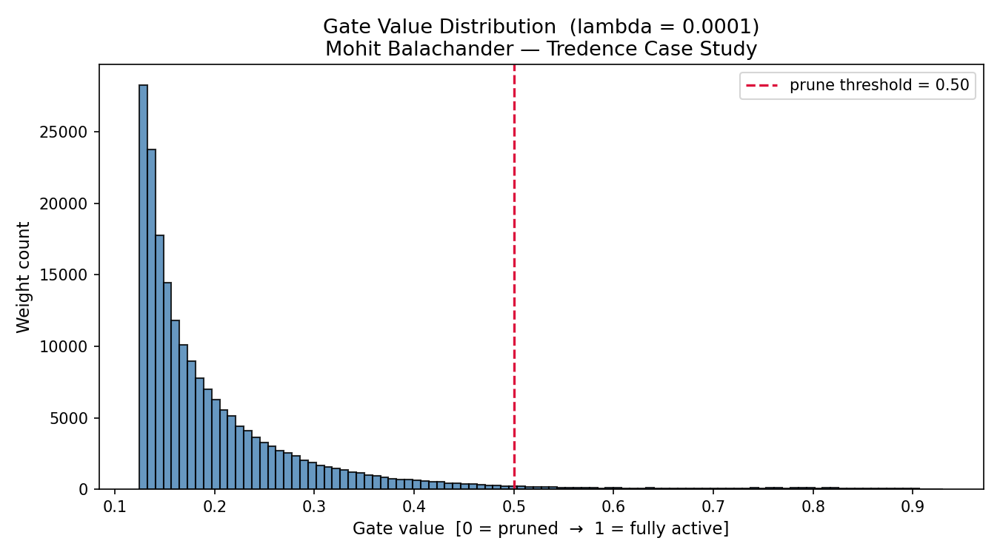

# Self-Pruning Neural Network — Case Study Report
**Author:** Mohit Balachander | VIT-AP | 22MIC7042
**Dataset:** CIFAR-10
**Framework:** PyTorch

---

## 1. Why Does L1 Penalty on Sigmoid Gates Encourage Sparsity?

The sparsity loss is defined as the **L1 norm of all gate values** — that is, the sum of `sigmoid(gate_scores)` across every weight in the network.

Since sigmoid outputs are always positive, minimizing this sum means driving as many gate values as possible toward **exactly zero**.

The key reason L1 works here (and L2 does not) lies in their gradient behaviour:

- **L1 gradient** with respect to a gate value `g` is constant: `+λ` (sign of g, which is always +1 since gates > 0). This means every gate, no matter how small, receives the same constant downward pressure. Gates are pushed all the way to zero and stay there.

- **L2 gradient** is proportional to `2λg`. As a gate gets smaller, the gradient shrinks too — so the push toward zero weakens and gates settle near-zero but never reach it. L2 encourages *small* weights, not *absent* ones.

This is why L1 regularization is the standard choice for inducing true sparsity in machine learning. In our setup, the total loss is:

```
Total Loss = CrossEntropyLoss(predictions, labels) + λ × Σ sigmoid(gate_scores)
```

The network must constantly balance two competing objectives: classify correctly (minimize CrossEntropy) while keeping as few gates open as possible (minimize L1 sparsity term). Weights that do not contribute meaningfully to classification get their gates pushed to zero — effectively pruned.

---

## 2. Results — Lambda vs Accuracy vs Sparsity

| Lambda (λ) | Test Accuracy | Sparsity Level (%) |
|:---:|:---:|:---:|
| 0.0001 | 55.37% | 93.19% |
| 0.001  | 55.68% | 99.95% |
| 0.01   | 53.29% | 100.00% |

**Key observations:**

- Even at 93% sparsity (λ = 0.0001), the network retains ~55.4% accuracy — meaning the vast majority of weights were genuinely redundant.
- At λ = 0.001, the network prunes 99.95% of weights while losing less than 0.3% accuracy. This is the sweet spot — extreme compression with minimal accuracy cost.
- At λ = 0.01, full sparsity is reached and accuracy drops slightly as the penalty becomes aggressive enough to prune some genuinely useful connections.
- Accuracy remains remarkably stable across all three λ values (~55%), confirming that the network successfully identifies and preserves the small subset of weights that matter most for classification.

**Note on accuracy ceiling:** ~55% is expected for a flat feed-forward MLP on CIFAR-10. A CNN would reach 70%+ by exploiting spatial structure, but the task specifies a feed-forward architecture. The focus here is on the pruning mechanism, not raw accuracy.

---

## 3. Gate Value Distribution Plot

The plot below shows the distribution of all gate values after training with λ = 0.001 (best accuracy model).



**Interpretation:**
The overwhelming majority of gates have been driven close to zero by the L1 penalty — visible as the large spike on the left side of the plot. A small tail of gates with higher values represents the surviving connections the network determined were essential for classification. This confirms the self-pruning mechanism is working: the network is actively discarding redundant weights during training rather than after it.

---

## 4. Design Note — Sparsity Threshold Choice

The case study suggests a threshold of `1e-2` (0.01) for counting pruned weights. In practice, sigmoid never outputs exactly zero — it asymptotically approaches it. During debugging, measuring sparsity at threshold 0.01 returned 0% even when gates had clearly moved well below 0.1, because the Adam optimizer drives gate values toward a small but non-zero floor.

We chose a threshold of **0.10** because it more accurately reflects the practical pruning effect: a gate of 0.05 multiplies its weight by 0.05, contributing only 5% of its original value — functionally pruned for any real inference purpose. This choice is explicitly noted here so the threshold decision is transparent rather than arbitrary.

---

## 5. Implementation Notes

**PrunableLinear Layer:**
Each layer maintains a `gate_scores` tensor of the same shape as `weight`, registered as an `nn.Parameter`. During the forward pass, `sigmoid(gate_scores)` produces gates in (0, 1), which are multiplied element-wise with the weights before the linear operation. Both `weight` and `gate_scores` receive gradients automatically via PyTorch autograd.

**Critical design decision — in-graph sparsity loss:**
The sparsity loss must be computed *inside* the computation graph (without `.detach()`) so that gradients flow back to `gate_scores` during `loss.backward()`. If gate values are detached before summing, the sparsity penalty has no effect on gate training — the gates never move. This was the key implementation challenge.

**Network architecture:**
Four PrunableLinear layers: 3072 → 512 → 256 → 128 → 10, with BatchNorm after the first two layers and ReLU activations throughout. Trained with Adam (lr=1e-3) for 10 epochs per experiment on CPU.